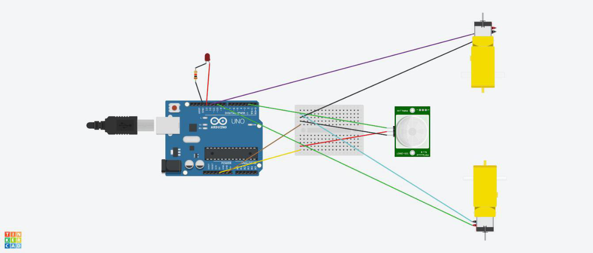
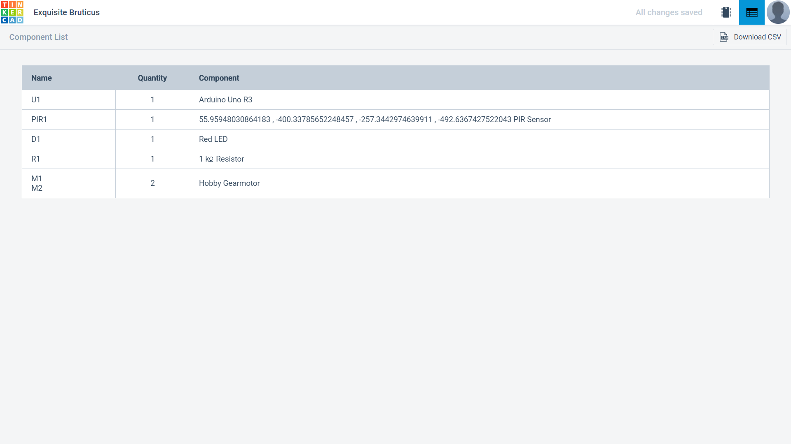
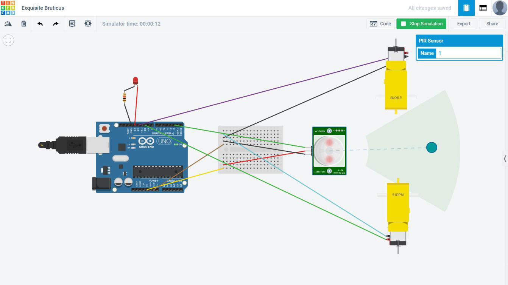
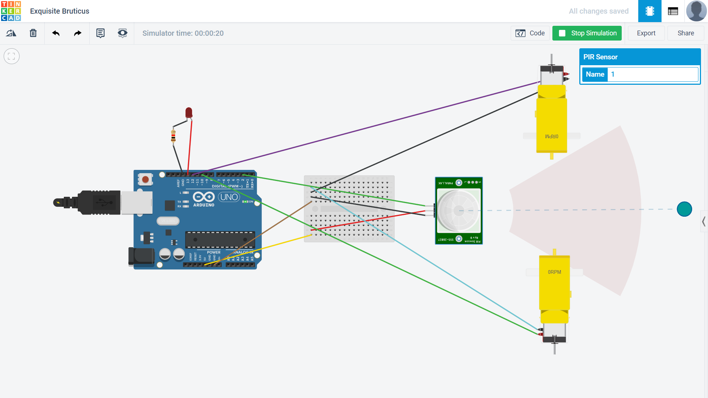

# Automatic-Food-Packets-Sanitisation-before-Distribution-to-People-during-COVID-19-TINKERCAD
The Government is distributing food to these Migrants and Daily Wage workers. There is a need to maintain hygiene before distributing food packets to these Migrants and Daily Wage workers and also make these process automatic and involve as less people as possible.Thus our Project provides the automatic sanitization of food packets before distribution to the Migrants and Daily Wage workers.

# Introduction
Our World has been recently hit with a pandemic COVID-19 virus crisis. This pandemic has devastated many of our lives. The main way to prevent this pandemic is through decreased social interaction and maintaining hygienic conditions as this virus spreads through contact of humans with surfaces or in turn in contact with other humans.
We seen especially in our country India that has been hit by this pandemic, the people who are mostly affected are Migrants and Daily Wage workers having no place to go.

# Motivation to carry out project
Due to the ever increasing condition of COVID-19 in India affecting us on a large scale.The major cases being of the Migrants and Daily Wage workers having nowhere to go. We must make sure that the Food Packets they receive are sanitized and safe to consume.

# Problem Statement
The Government is distributing food to these Migrants and Daily Wage workers. There is a need to maintain hygiene before distributing food packets to these Migrants and Daily Wage workers and also make these process automatic and involve as less people as possible.Thus our Project provides the automatic sanitization of food packets before distribution to the Migrants and Daily Wage workers.

# Circuit Design

# Components

# Implementation
Simulation done using Tinker Cad software:
Step 1: 1.Food Packet Detected by PIR Sensor in the range(highlighted by green area) and the led glows red indicating the detection. The motors are activated automatically depicted by 51 rpm to sanitize the food packets.

Step 2:Message is printed on Serial Monitor that Food Packet is Detected.

Step 3: The Food Packet here is out of range detected by PIR Sensor (highlighted by red area here). The Led does not glow and both the motors do not move depicted by 0 rpm.

Step 4:In this way the Food Packets can be Sanitized before giving it to the People in a Contact Free manner.

# Resources
The Code and Circuit design can be found in this repository

# Tools Used 
https://www.tinkercad.com/
